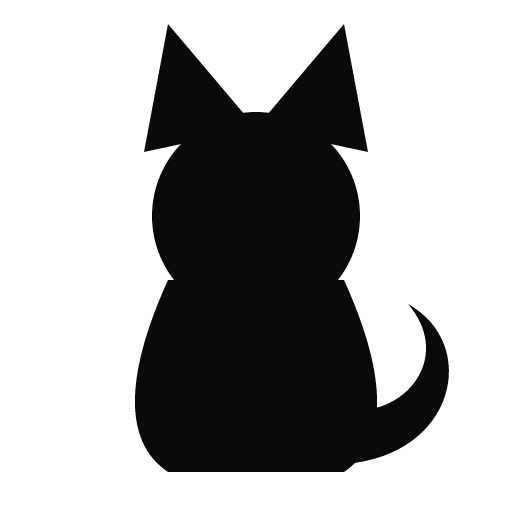

<div align="center">



# Cash

### The AI Operating System for Your Life

**One intelligence to run your entire life.**

Cash is one intelligence that runs your finances, calendar, communication, research, and code —
autonomously, and gets sharper every week.


</div>

---

## What is Cash?

For decades, software made **you** the operator — switching tabs, chasing threads, and trying to
remember what mattered.

**Cash inverts that.** It watches your markets, clears your inbox, defends your calendar, runs your
research, and answers you in plain language across every app you already use. It **remembers every
decision**, learns your judgment, and gets **measurably sharper** every week.

The only thing left for you is the part that was always yours alone — **decide, create, live.**

Cash has a personality, too. She's a cat. Warm and caring, but she *will* call you out when you skip
the gym or break a trading rule. She's not a generic assistant — she's yours.

<div align="center">

| | |
|---|---|
| **Before 8 AM** | Your market brief lands before the day starts |
| **15 minutes** | A pre-meeting brief ahead of every call |
| **Every week** | It reviews its own work and improves |

</div>

---

## Plugs into everything you already run on

One intelligence, wired across your whole stack — finance, comms, calendar, code, and more.

<p align="center">
  &nbsp;&nbsp;&nbsp;
  &nbsp;&nbsp;&nbsp;
  &nbsp;&nbsp;&nbsp;
  &nbsp;&nbsp;&nbsp;
  &nbsp;&nbsp;&nbsp;
  &nbsp;&nbsp;&nbsp;
  &nbsp;&nbsp;&nbsp;
  
</p>
<p align="center">
  &nbsp;&nbsp;&nbsp;
  &nbsp;&nbsp;&nbsp;
  &nbsp;&nbsp;&nbsp;
  &nbsp;&nbsp;&nbsp;
  &nbsp;&nbsp;&nbsp;
  &nbsp;&nbsp;&nbsp;
  
</p>

---

## What Cash does

- **Remembers everything** — "I want to skip sugar this week" → she'll bring it up 3 days later
- **Multi-calendar** — merges Google Calendar + Outlook into one unified view, and reschedules across days by voice
- **Smart scheduling** — auto-resolves conflicts (shifts gym when meetings overlap, suggests alternatives)
- **Daily briefings** — morning wake-up + evening wrap-up, sent automatically in Cash's voice
- **Task tracking** — todo list with automatic rollover for unfinished tasks
- **Trading rules** — recites your rules before market open, calls you out if you break discipline
- **Meeting tracking** — pings you if a meeting ended and you haven't confirmed attendance
- **Multi-platform** — same brain and memory across Telegram, Discord, and (via adapters) Slack & Teams
- **Natural language** — just talk to her; Claude figures out intent and Cash responds in character
- **Feels alive** — a live "typing…" indicator while she thinks, then her reply reveals with a typewriter effect

---

## Watch it work

Just talk to Cash naturally:

```
"what's my day look like"            → full briefing
"move gym to 6pm"                    → reschedules the event
"move tomorrow's 6pm run to today"   → reschedules across days
"what's on July 6?"                  → shows that specific day's schedule
"I want to eat clean this week"      → stored as a weekly decision
"did I say I'd call mom?"            → searches conversation memory
"done with meditation"               → marks task done + fulfills decision
"add buy groceries to my list"       → adds a task
"what are my trading rules?"         → shows your rules
"I bought NIFTY at 22500"            → logged to the trading journal
"create a meeting at 3pm for 1 hour" → creates a calendar event
```

---

## Commands

| Command        | What Cash does                                        |
| -------------- | ----------------------------------------------------- |
| `/start`       | Cash introduces herself and shows connected calendars |
| `/briefing`    | Full daily briefing — schedule, tasks, gym, trading   |
| `/tasks`       | Today's task list with status                         |
| `/done <task>` | Mark a task as done (by name or ID)                   |
| `/add <task>`  | Add a new task to today's list                        |
| `/schedule`    | Today's calendar (all connected sources)              |
| `/conflicts`   | Detect and resolve schedule conflicts                 |
| `/rules`       | Your trading rules                                    |
| `/decisions`   | Active intentions and decisions Cash is tracking      |
| `/memory`      | Everything Cash remembers about you                   |
| `/calendars`   | Status of connected calendar sources                  |
| `/settings`    | Your current profile                                  |

---

## How memory works

Every message is logged, and Cash extracts and stores what matters:

| What you say                     | What gets stored                                     |
| -------------------------------- | ---------------------------------------------------- |
| "I want to…" / "today I'll…"     | Decision with expiry (today / this week / permanent) |
| "I like…" / "my friend X…"       | Permanent fact about you                             |
| "I finished X"                   | Decision marked as fulfilled                         |
| "Bought NIFTY at 18000"          | Trade entry in the journal                           |

Before every response, Cash injects your recent memory, active decisions, and learned facts into
context — so she genuinely knows what you said 5 days ago and references it naturally.

---

## One brain, every platform

Cash works across Telegram, Discord, and (via adapters) Slack and Teams, with per-person memory and
enforceable directives ("ignore X", "auto-reply to Y"). One person's memory is shared across every
platform they use — talk to Cash on Telegram, pick up the thread on Discord.
